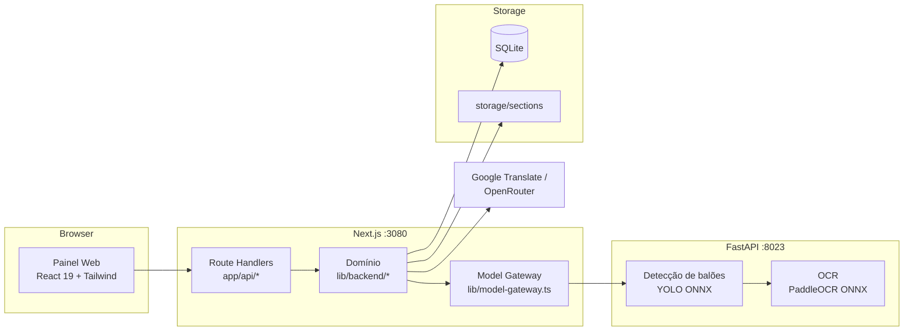

<div align="center">

<a href="https://github.com/marco0antonio0/translate-manga-br">
  
</a>

# 🈂️ Manga Translator Local

### Traduza mangás na sua máquina. Detecte balões · Extraia texto · Traduza · Leia

<samp>Plataforma local-first de OCR, tradução e leitura editável de mangás —<br>
IA rodando em CPU, seus dados ficam com você.</samp>

<br>
<br>

[](https://github.com/marco0antonio0/translate-manga-br/stargazers) [](LICENSE.md) [](CONTRIBUTING.md)

[](https://nextjs.org) [](https://react.dev) [](https://www.typescriptlang.org) [](https://www.python.org) [](https://fastapi.tiangolo.com) [](https://www.sqlite.org) [](https://docs.docker.com/compose/) [](https://onnxruntime.ai)

<br>

<kbd><a href="#-quick-start">&nbsp;🚀 Quick Start&nbsp;</a></kbd> &nbsp;&nbsp; <kbd><a href="#-features">&nbsp;✨ Features&nbsp;</a></kbd> &nbsp;&nbsp; <kbd><a href="#%EF%B8%8F-arquitetura">&nbsp;🏗️ Arquitetura&nbsp;</a></kbd> &nbsp;&nbsp; <kbd><a href="#-documentação">&nbsp;📚 Docs&nbsp;</a></kbd> &nbsp;&nbsp; <kbd><a href="#-contribuindo">&nbsp;🤝 Contribuir&nbsp;</a></kbd>

<br>
<br>


<sub>📖 Painel web, leitor com overlay editável e pipeline de IA — tudo local.</sub>

</div>

<br>

<div align="center">

`📤 upload` &nbsp;→&nbsp; `🎯 detecção YOLO` &nbsp;→&nbsp; `🔍 OCR PaddleOCR` &nbsp;→&nbsp; `🌐 tradução` &nbsp;→&nbsp; `📖 leitura editável`

</div>

---

## 📖 Visão geral

**Manga Translator Local** é uma aplicação full stack para traduzir páginas de mangá em ambiente local. O projeto combina painel web, detecção de balões de texto com YOLO, OCR com PaddleOCR, tradução e um leitor com overlay editável.

O princípio central é **local-first**: processamento e armazenamento ficam sob controle do usuário (SQLite + arquivos em `storage/`). A única exceção são os provedores externos de tradução — Google Translate ou OpenRouter — quando selecionados.

## ✨ Features

| | Feature | Descrição |
| --- | --- | --- |
| 📤 | **Upload e organização** | Envie páginas e organize por seções em uma biblioteca |
| 🎯 | **Detecção de balões** | Modelo YOLO ONNX local localiza as caixas de texto |
| 🔍 | **OCR local** | Extração de texto com PaddleOCR ONNX, sem depender de nuvem |
| 🌐 | **Tradução flexível** | Google Translate ou OpenRouter (modelo configurável no painel) |
| 📖 | **Leitor editável** | Imagem original com caixas de diálogo ajustáveis (texto, posição, tamanho, aparência) |
| 🔗 | **Compartilhamento** | Link público de leitura por seção |
| 👥 | **Multiusuário** | Setup inicial de admin e gestão de usuários |
| ⏱️ | **Fila global** | Acompanhe o processamento de todas as seções |
| 💾 | **Persistência local** | SQLite + arquivos em `storage/`, com migrações versionadas |

## 🚀 Quick Start

### Pré-requisitos

- **Node.js 20+** (`.nvmrc` aponta 22 para desenvolvimento local; Docker usa Node 20)
- **Python 3.11+**
- **Docker + Docker Compose** (opcional, para execução conteinerizada)

### Desenvolvimento local

```bash
git clone https://github.com/marco0antonio0/translate-manga-br.git
cd translate-manga-br
npm install
npm run dev
```

| Serviço | URL |
| --- | --- |
| Web | <http://localhost:3080> |
| Python API | <http://localhost:8023> |

> [!TIP]
> Na primeira execução, acesse **`/setup`** para criar o usuário administrador.

### Docker Compose

```bash
docker compose up -d --build   # subir
docker compose down            # parar
```

No Compose, a Python API fica acessível apenas internamente (`python-api:8023`), sem porta pública exposta.

## 🏗️ Arquitetura



### Estrutura do repositório

```text
app/             # páginas, layouts e route handlers do Next.js
components/      # componentes de UI e fluxo de usuário
lib/             # backend local, domínio, segurança e integrações
python-api/      # FastAPI, OCR, detecção e pipeline de imagem
storage/         # SQLite e dados gerados localmente (não versionado)
scripts/         # automação de desenvolvimento e auditoria
docs/            # diagramas e documentação auxiliar
```

| Módulo | Responsabilidade |
| --- | --- |
| `app/api/*` | BFF/backend local da aplicação |
| `lib/backend/*` | Regras de domínio, repositórios e acesso ao SQLite |
| `lib/model-gateway.ts` | Ponte entre Next.js e a FastAPI |
| `python-api/` | Detecção de boxes, OCR e endpoints de processamento |
| `storage/` | Banco local, imagens enviadas e artefatos gerados |

## 🔄 Fluxo de processamento

<p align="center">
  
</p>

1. O usuário cria uma seção no painel e envia imagens.
2. O backend Next.js recebe o `FormData`, valida sessão e dados.
3. Metadados são gravados no SQLite e imagens em `storage/sections`.
4. O backend chama a FastAPI via `lib/model-gateway.ts`.
5. A API Python detecta os balões com YOLO ONNX e extrai o texto com PaddleOCR ONNX.
6. O texto extraído é traduzido pelo provider escolhido.
7. OCR, tradução e status são gravados no SQLite.
8. O leitor renderiza a imagem original com caixas de diálogo editáveis.

> [!NOTE]
> Google Translate e OpenRouter dependem de rede externa. O OpenRouter exige API key cadastrada por um admin em `/inicio/preferencias` — a chave é armazenada criptografada em repouso (`lib/security/secrets.ts`).

## 🧠 Modelos utilizados

- **Detecção de balões** — modelo YOLOv8/ONNX treinado por Marco Antonio da Silva Mesquita.
- **OCR** — PaddleOCR com modelos ONNX locais.
- **Renderização editável** — feita no frontend, sobre a imagem original, a partir dos boxes detectados e textos traduzidos.

## 🗺️ Rotas principais

| Rota | Descrição |
| --- | --- |
| `/` | Tela pública inicial |
| `/setup` | Configuração inicial do administrador |
| `/login` | Autenticação |
| `/inicio` | Painel principal |
| `/inicio/secoes` | Biblioteca de seções |
| `/inicio/secoes/nova` | Criação de seção e upload |
| `/inicio/secoes/[id]` | Leitor privado da seção |
| `/inicio/fila-global` | Fila global de processamento |
| `/inicio/usuarios` | Gestão de usuários |
| `/inicio/preferencias` | Preferências e OpenRouter |
| `/publico/secoes/[key]` | Leitor público por link |
| `/termos` | Termos e privacidade |

## ⚙️ Configuração

| Variável | Uso |
| --- | --- |
| `MODEL_API_BASE_URL` | URL da API Python usada pelo Next.js. Padrão local: `http://localhost:8023` |
| `TRANSLATE_API_KEY` | Chave opcional enviada do Next.js para a API Python como `X-API-Key` |
| `ALLOW_REMOTE_SETUP` | Permite setup inicial remoto quando definido como `1` |
| `SKIP_DB_BOOTSTRAP` | Pula bootstrap/migrações SQLite em cenários controlados |
| `SECURITY_ENABLE_PIP_AUDIT` | Habilita `pip-audit` no script `security:deps` |

<details>
<summary><b>Configurando o OpenRouter</b></summary>

1. Acesse `/inicio/preferencias` com usuário admin.
2. Informe a API key do OpenRouter.
3. Selecione o modelo disponível.
4. Salve e use o provider na criação/processamento de seções.

A chave é armazenada criptografada em repouso usando `lib/security/secrets.ts`.

</details>

## 🗃️ Banco de dados e migrações

O schema SQLite é versionado em `lib/backend/shared/migrations/`.

- **Banco local:** `storage/local.sqlite`
- **Tabela de controle:** `schema_migrations`
- **Aplicação:** automática no bootstrap da aplicação
- **Compatibilidade:** migrações idempotentes com `IF NOT EXISTS`

> [!IMPORTANT]
> Faça backup antes de upgrades:
> ```bash
> cp storage/local.sqlite storage/local.sqlite.bak.$(date +%Y%m%d-%H%M%S)
> ```

## 🧰 Comandos úteis

| Comando | Descrição |
| --- | --- |
| `npm run dev` | Sobe Next.js e Python API localmente |
| `npm run dev:web` | Sobe apenas o Next.js na porta 3080 |
| `npx tsc --noEmit` | Valida TypeScript explicitamente |
| `npm run build` | Build de produção do Next.js |
| `npm run start` | Inicia build de produção na porta 3080 |
| `npm run security:deps` | Executa auditoria npm e assinaturas/proveniência |
| `SECURITY_ENABLE_PIP_AUDIT=1 npm run security:deps` | Inclui auditoria Python quando `pip-audit` estiver disponível |

## 🩺 Troubleshooting

<details>
<summary><b><code>better-sqlite3</code> sem binding nativo</b></summary>

Sintoma: erro dizendo que `better_sqlite3.node` não foi encontrado.

```bash
npm rebuild better-sqlite3
```

Se persistir, reinstale dependências com a mesma versão de Node usada no projeto.

</details>

<details>
<summary><b>Portas 3080 ou 8023 ocupadas</b></summary>

O script `npm run dev` tenta encerrar processos antigos do próprio projeto. Para evitar o encerramento automático:

```bash
AUTO_KILL_DEV_PORTS=false npm run dev
```

Também é possível trocar portas:

```bash
NEXT_PORT=3090 PYTHON_API_PORT=8030 npm run dev
```

</details>

<details>
<summary><b>TypeScript passa no build, mas falha no <code>tsc</code></b></summary>

O build atual do Next.js ignora erros TypeScript. Use `npx tsc --noEmit` como fonte de verdade para tipos.

</details>

## 🚧 Status do projeto

Este projeto está em evolução ativa. Algumas decisões técnicas ainda estão sendo consolidadas:

- [ ] Consolidar o gerenciador de pacotes — o Docker usa `npm ci` + `package-lock.json`, mas o repositório ainda contém `pnpm-lock.yaml` e `bun.lock`. Até lá, **use `npm`**.
- [ ] Remover o bypass de erros TypeScript no build (`next.config.mjs`) — rode `npx tsc --noEmit` separadamente.
- [ ] Declarar `eslint` nas dependências (o script `lint` existe, mas falha em ambientes novos).
- [ ] Persistir a imagem traduzida final como arquivo separado — hoje o leitor renderiza a original com overlay editável.

## 🔐 Segurança e privacidade

- Sessão local com cookie `httpOnly`.
- Rotas mutáveis protegidas por validação de origem.
- Setup inicial bloqueado para acesso não-local, salvo quando `ALLOW_REMOTE_SETUP=1`.
- Chaves sensíveis do OpenRouter criptografadas em repouso.
- Dados gerados ficam em `storage/`, que não deve ser versionado.
- Dependabot semanal (npm, pip, GitHub Actions) + auditoria local com `npm run security:deps` — relatórios em `storage/security/`.

Encontrou uma vulnerabilidade? Veja a [política de segurança](SECURITY.md).

## 📚 Documentação

| Documento | Conteúdo |
| --- | --- |
| [CONTRIBUTING.md](CONTRIBUTING.md) | Fluxo de contribuição, padrões de commit e validação pré-PR |
| [LEARN.md](LEARN.md) | Trilha de aprendizado para estudantes e novos contribuidores |
| [SECURITY.md](SECURITY.md) | Política de report de vulnerabilidades |
| [CODE_OF_CONDUCT.md](CODE_OF_CONDUCT.md) | Código de conduta da comunidade |
| [AGENT.md](AGENT.md) | Contexto para agentes de IA trabalhando no repositório |

> [!NOTE]
> Os textos legais (termos, privacidade, aceites) são centralizados em `lib/legal-content.ts` e consumidos por `app/termos/page.tsx` e `components/terms-modal.tsx`. Para alterá-los, edite apenas esse arquivo.

## 🤝 Contribuindo

Contribuições são muito bem-vindas! As áreas onde ajuda é mais valiosa:

- 🐛 Correções de bugs no fluxo de setup, login, criação de seção e leitor
- 🎨 Melhorias de UX e acessibilidade
- 🛟 Robustez de erros e estados de loading
- ⚡ Performance em CPU
- 🧪 Testes e validações automatizadas
- 📝 Documentação técnica

Antes de abrir um PR, rode pelo menos:

```bash
npx tsc --noEmit
npm run build
```

Leia o guia completo em [CONTRIBUTING.md](CONTRIBUTING.md). Novo em open source? Comece pelo [LEARN.md](LEARN.md).

## 📄 Licença

Este projeto é open source sob a **licença MIT** — use, modifique, distribua e até venda livremente, contanto que mantenha o aviso de copyright e a licença original.

Leia os termos completos em [LICENSE.md](LICENSE.md).

## ⭐ Apoie o projeto

Se este projeto te ajudou, considere deixar uma estrela no repositório — isso ajuda na visibilidade e motiva a evolução contínua.

<div align="center">

**[⬆ Voltar ao topo](#readme)**

Feito com ❤️ por [Marco Antonio](https://github.com/marco0antonio0)

</div>
